# Socialization 开发计划（DEVELOPMENT_PLAN.md）

> 版本：v2.0 ｜ 日期：2026-08-02 ｜ 状态：待审核
>
> v2.0 依据本机 `installed-apps.txt` 中的实际软件版本重写：**不再依赖 Docker、WSL、PostgreSQL**，改为**原生 Windows + SQLite** 实现。配套文档：[TASKS.md](./TASKS.md)。

---

## 0. 变更记录（v1.0 → v2.0）

| 项 | v1.0 | v2.0（本版） | 原因 |
|---|---|---|---|
| 运行环境 | Docker Compose（db/backend/frontend 三容器） | 原生 PowerShell 脚本（venv + uvicorn + vite） | 本机注册表异常，无法安装 Docker/WSL |
| 数据库 | PostgreSQL 16 + pgvector | SQLite 3.49.1（Python 3.13.5 内置，已验证） | 零安装、零服务、免注册表 |
| 向量检索（P1） | pgvector | sqlite-vec 扩展；不可用则纯 Python（numpy）余弦回退 | SQLite 生态等价方案 |
| 全文搜索（P1） | — | SQLite FTS5（Python 内置支持） | 替代独立搜索引擎 |
| 后台任务 | Celery/Redis（可选） | FastAPI 进程内 asyncio 任务队列 | 单用户本地无需消息队列 |
| 数据库备份 | pg_dump | `sqlite3` backup API / `VACUUM INTO` 文件快照 | 单文件一致性备份 |

**对 PRD 的偏差声明**（功能不变，仅实现方式）：

- PRD 17.1#14「Docker Compose 本地部署」与 17.4 阶段一「启动 PostgreSQL 和 pgvector」在本机替换为「`scripts/setup.ps1` 一键初始化 + `scripts/dev.ps1` 一键启动 + SQLite 数据库」；验收等价（一条命令可运行、可备份恢复）。
- PRD 第 9.1 节技术栈中的 PostgreSQL/pgvector 替换为 SQLite/sqlite-vec（D11、D12），其余技术选型（React/FastAPI/SQLAlchemy/Alembic/Tiptap 等）不变。
- 若未来其他机器需要 Docker 部署，可补充 `deploy/docker/` 模板，不影响本项目代码结构。

---

## 1. 环境基线（依据 installed-apps.txt 与本机验证）

以下版本全部来自 `E:\Socialization\installed-apps.txt`，带“已验证”的为运行时确认：

| 软件 | installed-apps.txt 版本 | 本项目用途 | 备注 |
|---|---|---|---|
| Python 3.13.5 (64-bit) | 3.13.5（已验证） | 后端运行时 | 路径 `C:\Users\24278\AppData\Local\Programs\Python\Python313`；内置 SQLite 3.49.1 |
| Node.js | 24.13.0（已验证） | 前端运行时 | 路径 `E:\nextjs\nodejs\node.exe`；npm 11.6.2（已验证） |
| Git | 2.55.0.2（已验证 2.55.0.windows.2） | 版本管理 | `D:\Git\cmd\git.exe` |
| Visual Studio Code (User) | 1.131.0 | 编辑器 | 已装，无需注册表写入 |
| Windows Terminal | 1.24.11911.0 | 终端 | 已装 |
| PowerShell | 7.6.3.0（已验证 7.6.3） | 脚本执行 | 脚本同时兼容 Windows PowerShell 5.1 写法 |
| Google Chrome | 150.0.7871.187 | 调试浏览器 | 已装 |
| Microsoft Edge | 150.0.4078.105 | 调试浏览器（备选） | 已装 |
| Microsoft Visual C++ 2015-2022 Redistributable | 14.44.35211 | 原生 Python 轮子的系统依赖 | 已装，无需再装 |
| Microsoft App Installer (winget) | 1.29.280 | 可选工具安装通道 | 优先使用便携 zip，避免写注册表 |
| uv | 0.8.2（已验证，未在清单中） | 依赖加速/可选 Python 管理 | `C:\Users\24278\AppData\Local\Programs\Python\Python313\Scripts\uv.exe` |

**清单中存在但本项目不采用**（避免服务与复杂度）：

| 软件 | 版本 | 不采用原因 |
|---|---|---|
| MySQL Server 8.0 | 8.0.46 | 无原生向量类型；需要服务、端口、账号与独立备份；对单用户本地应用为净复杂度 |
| Microsoft SQL Server 2019 LocalDB | 15.0.2000.5 | 同上；无向量类型 |
| Python 3.9.13 | 3.9.13 | 版本过旧，统一使用 3.13.5 |
| Android Studio / Java 8 / .NET SDK 6 | 2025.1 / 8.0.4410.7 / 6.0.428 | 与本项目无关 |

> 如你明确希望使用已安装的 MySQL 8.0.46（配合 Navicat 16 管理），可以切换：SQLAlchemy 方言、迁移类型与备份方式需要调整，但 API/前端/加密/对话功能全部不变。本计划默认 SQLite，切换成本低。

---

## 2. 需求评审结论

### 2.1 总体结论

PRD 功能定位与技术选型整体可落地。在“不安装任何系统级软件”的约束下，SQLite 是单用户本地应用的最优数据库：Python 3.13.5 内置、单文件、WAL 并发模式、FTS5 全文检索、备份即文件快照；P1 向量检索用 sqlite-vec（pip 轮子）或纯 Python 余弦回退，个人知识库规模（数千 chunk）性能足够。

### 2.2 冲突与不一致（需要决策的项）

| # | 问题 | 位置 | 影响 | 本计划采用的决策 |
|---|---|---|---|---|
| C1 | 验收标准要求“删除和修改操作具有审计信息”，但 5.1 与 17.4 的表清单都没有审计表 | 15.验收标准 #14；5.1 | 直接落不了地 | 新增 `audit_logs` 表，P0 写入关键实体变更；审计写入放在 Repository 层 |
| C2 | `backup_records` 在 17.4 要求创建，但 5.1 核心表清单缺失 | 17.4 阶段二 vs 5.1 | 表清单不一致 | 以 17.4 为准，P0 创建 `backup_records` |
| C3 | 4.2.4 人物详情含“待跟进事项”、5.1 有 `follow_up_tasks`，但 P0 表清单没有 | 4.2.4；5.1；17.4 | P0 范围不明确 | P0 建表 + 基础列表接口（互动记录的“后续事项”落库）；提醒闭环放 P2 |
| C4 | “API Key 不得返回前端”与“界面只能显示掩码” | 7.1；8.2；17.3#9 | 需要明确掩码实现方式 | 前端只能拿到 `has_api_key`、`key_hint`（末 4 位）和服务端生成的掩码串；密钥与自定义请求头均为写后只读，永不下发明文 |
| C5 | 主密码解锁流程未定义：AES-256-GCM 密钥如何进入运行时 | 7.1 | 加密无法闭环 | 首次启动前端引导设置主密码；后端用 Argon2id 派生密钥并仅保存在内存，每次启动需解锁；提供“重置密钥并清除全部已加密密钥”的兜底路径 |
| C6 | DeepSeek / OpenAI / 通用 OpenAI 兼容接口本质是同一种协议，三个适配器重复 | 9.1；17.3#4 | 代码重复、难维护 | `OpenAICompatibleProvider` 为通用实现；DeepSeek、OpenAI 仅作为预设配置子类（预设 base_url 与默认模型），模型名一律来自同步/手动，不写死 |
| C7 | 嵌入模型依赖缺失：DeepSeek 官方无 embeddings 接口，但 P1 需要向量化 | 13.P1；5.1 `document_chunks.embedding` | P1 可能卡住 | P1 引入“嵌入提供商”独立配置（OpenAI 或兼容嵌入端点；或本地嵌入模型），与聊天提供商分离；P0 不涉及 |
| C8 | 首版“删除需二次确认”+“支持软删除和彻底删除”，但 5.2 只有 `archived` | 7.2；8.2；17.3#17 | 删除语义不清 | 核心表统一增加 `deleted_at` 软删除；列表/详情默认过滤；彻底删除走单独端点；前端一律二次确认 |
| C9 | 4.6.3 上下文组装包含检索片段，但 P0 无 RAG | 4.6.3；13.P1 | P0 不能做假检索 | P0 上下文组装器预留“检索片段”空槽位，只组装人物/话题/会话/最近消息；P1 填入真实检索结果 |
| C10 | 17.6#9“不允许只创建空页面”与信息架构 10 个导航入口 | 三、信息架构；17.6#9 | 冲突 | P0 导航只显示已实现模块；未实现模块不在导航中出现（或显示禁用态），不创建空页面 |
| C11 | 第 14 章测试要求包含 P2 功能（如“创建人物到生成聊天简报”） | 14 | 阶段测试矩阵错位 | 测试矩阵按阶段裁剪：P0 只测 P0 功能，P2 功能测试随 P2 引入 |
| C12 | “数据导入”范围过大：CSV/JSON/Markdown/文件夹批量 | 4.12；17.1#13 | P0 做不完 | P0 只做 JSON 全量导入/导出 + 数据库备份/恢复 + 单实体 Markdown 导出；CSV、Markdown、文件夹导入放 P1 |
| C13 | `user_profiles`（表达偏好）用于上下文组装，但 P0 无用户模块 | 5.1；4.6.3 | 上下文缺一块 | P0 在 `app_settings` 内置最小表达偏好字段；完整 `user_profiles`（社交目标等）放 P2 |
| C14 | `conversation_summaries`、`context_snapshots` 在 5.1 有、P0 表清单无 | 5.1；17.4 | 长对话压缩归期不明 | P0 在 `conversations` 存 `summary` 文本、在消息 metadata 存最小上下文快照 JSON；正式压缩功能与表结构放 P1 |
| C15 | PRD 要求 Docker Compose 部署，但本机注册表异常无法安装 Docker/WSL | 17.1#14；17.4 阶段一 | 部署方式必须更换 | 原生 PowerShell 脚本替代（见第 0 节偏差声明）；保留未来补充 Docker 模板的空间 |
| C16 | PRD 技术栈指定 PostgreSQL+pgvector，本机未安装且无法安装 | 9.1；5.2 | 数据库层必须更换 | SQLite + sqlite-vec/FTS5（D11/D12）；数据库访问全部经过 SQLAlchemy，替换成本可控 |
| C17 | PRD 7.1 要求主密码 + Argon2id 解锁流程；用户明确表示个人自用、加密不用做太细 | 7.1；用户本轮要求 | 需要显著简化加密方案 | 采用 D15：首次运行自动生成本地密钥文件（AES-GCM）加密 API Key；无主密码、无解锁页；API Key 仍加密入库且日志过滤 |

### 2.3 缺失项（PRD 未覆盖，但必须补充定义）

1. **标签 API**：PRD 第 12 节没有 `/api/tags`，但 4.2.3 与 P0 都要标签 → 补 tags CRUD、批量关联、按标签筛选。
2. **话题分类 API**：4.4.1 要求多级分类，第 12 节无对应端点 → 补 topic-categories 树形 CRUD。
3. **设置 API**：`app_settings` 在 P0 表清单中，但无端点 → 补 `/api/settings`。
4. **备份/导入导出 API**：目录结构有 `backup.py`，第 12 节未列端点 → 补备份、恢复、JSON 导入导出、Markdown 导出端点。
5. **停止生成 / 重新生成端点**：17.4 阶段六要求“停止生成、重新生成”，第 12 节未列 → 补 cancel / regenerate 端点。
6. **分页约定**：17.3#18 要求所有列表分页，但无统一格式 → 统一 `page`、`page_size` 查询参数，响应 `{items, total, page, page_size}`，默认 20、最大 100。
7. **时间线排序规则**：4.2.4 要求时间线，未定义组成 → 时间线 = 互动记录 + 人物事实（带时间字段）+ 重要日期 按时间倒序合并、分页。
8. **消息状态机**：流式中断后的状态未定义 → `conversation_messages.status ∈ {generating, completed, failed, stopped}`；重新生成替换同一 AI 消息，失败详情保留在 metadata。
9. **密钥生命周期操作**：有“立即删除密钥”需求但无端点 → PATCH 提供商时支持 `clear_api_key: true` 清除密钥。
10. **代理实现**：提供商字段含代理设置 → 使用 httpx 的 proxy 配置，P0 支持 provider 级代理与 `HTTPS_PROXY` 环境变量。
11. **“AI 将发送哪些类别信息”的可见性**：7.2 要求 AI 调用前展示 → 后端提供“上下文范围”清单接口，前端对话页右侧面板展示（17.5）。
12. **审计内容定义**：记录实体类型、实体 ID、动作（create/update/delete/restore/import）、变更摘要、时间；不做字段级 diff（P0 简化）。

### 2.4 落地风险与缓解

| 风险 | 等级 | 缓解措施 |
|---|---|---|
| SQLite 并发写限制 | 低 | WAL 模式 + `busy_timeout`；单用户本地应用写频率极低；必要时读写分离连接 |
| sqlite-vec 轮子是否支持 Windows/cp313（P1） | 低 | 有官方轮子优先；无则回退纯 Python（numpy）余弦，个人规模足够 |
| XLSX/PPTX 解析质量参差（P1） | 中 | 解析器插件化；文档状态支持“部分失败/解析失败/重新处理”；表格独立处理 |
| 外网 AI API 不可达（DeepSeek/OpenAI） | 中 | 提供商级代理配置；用户消息先保存、失败可重试；超时与重试参数可配 |
| 主密码遗忘导致密钥丢失 | 中 | 提供“重置密钥”流程（清除全部已加密密钥，需用户二次确认）；README 说明 |
| 首次打开 2 秒目标 | 低 | 前端路由懒加载、代码分割、分页列表 |
| OCR/音视频/本地模型体积大（P3） | 中 | 独立可选模块，不影响主架构；先做网页粘贴等轻量路径 |
| 网页抓取受目标站点限制 | 中 | 以用户主动粘贴/手动收藏为主，自动抓取列为可选 |

---

## 3. 阶段划分（P0–P3）

| 阶段 | 名称 | 目标 | 主要内容 | 完成标准（出口条件） |
|---|---|---|---|---|
| **P0** | 可运行基础版 | `.\scripts\dev.ps1` 一键启动，完成“人-互动-话题-AI 对话-备份”主闭环 | 原生环境脚本、SQLite 迁移、人物/标签/互动、话题与 Tiptap 笔记、AI 提供商与模型、流式对话与历史、API Key 加密、导入导出与备份 | PRD 17.1 的 14 项中 13 项 + 原生一键启动（替代 Docker 项）全部可用；15 章验收标准中适用于 P0 的 12 项（见 TASKS.md 对照表） |
| **P1** | 知识库版本 | AI 能基于用户上传的资料回答问题并给出引用 | 文件上传与解析（PDF/DOCX/PPTX/XLSX/TXT/MD/HTML）、文本切分、嵌入配置、sqlite-vec 检索、文件问答与引用、FTS5 全局搜索、自定义字段、CSV/Markdown/文件夹导入、长对话压缩 | 上传资料后，AI 只基于指定人物/话题/文件范围回答并显示引用；全局搜索 < 1s |
| **P2** | 社交能力版本 | 从“记录”升级为“准备-练习-复盘-成长”闭环 | 聊天简报、互动信息自动提取+用户确认、聊天复盘、AI 模拟聊天与多维度评分（带对话证据）、社交目标、间隔复习、每周成长报告、长期记忆审批、人物关系基础 CRUD、待跟进提醒 | 聊天前能生成简报，聊天后能复盘，AI 提取的信息全部经过用户确认后写入 |
| **P3** | 增强版本 | 扩展输入形态与设备覆盖 | 人物关系图、OCR、音频转文字、视频字幕、网页收藏/浏览器扩展、移动端适配、Tauri 桌面打包、本地模型（Ollama）、可选云同步 | 按模块独立验收，不阻塞 P0–P2 主链路 |

> 建议节奏（个人自用，按对话轮次推进）：R1 一轮完成基础平台与人物/互动；R2 一轮完成话题笔记与 AI 对话；R3 一轮完成备份与收尾。P1/P2/P3 产品阶段仍按 PRD 定义，不设统一截止。

---

## 4. P0 任务分解总览

> 个人自用场景：P0 的实施由原 M0–M7 八个里程碑合并为 **R1–R3 三个大阶段**（决策 D16），每个阶段以“功能块”为单位验收，详见 [TASKS.md](./TASKS.md)。

| 阶段 | 内容（合并自） | 关键交付 | 验收主线 |
|---|---|---|---|
| **R1 基础平台与人物/互动** | M0 + M1 + M2 | 一条命令启动、SQLite 全量 P0 表迁移、人物/标签/事实/日期/跟进/互动/时间线（后端+前端） | 建人→加标签→记互动→看时间线 |
| **R2 话题笔记与 AI 对话** | M3 + M4 + M5 | 话题分类/话题/Tiptap 笔记自动保存；提供商管理（简化加密）；SSE 流式对话与历史；人物/话题关联 | 建话题写笔记 → 配置 DeepSeek → 流式对话可保存 |
| **R3 备份与收尾** | M6 + M7 | JSON 导入导出、SQLite 快照备份/恢复、Markdown 导出、README、端到端手测与安全自查 | 备份→清库→恢复成功；对照 17.1 全部通过 |

> M0（项目骨架、脚本、健康检查、基础测试）已在本机完成并提交（`410f70b`），R1 直接在其基础上继续。

---

## 5. 推荐最终目录结构

> 结构以 PRD 第 10、11 章为基础，按第 2 节决策增补；`# P1`/`# P2` 标注的目录可延后创建。无 Dockerfile、无 docker-compose。

```text
Socialization/
├── PRD.md                          # 只读，不修改
├── installed-apps.txt              # 本机软件清单（环境基线依据）
├── DEVELOPMENT_PLAN.md
├── TASKS.md
├── README.md                       # 完整安装/启动/备份恢复/使用说明（M7）
├── LICENSE
├── .gitignore
├── .editorconfig
├── .env.example                    # DATABASE_URL、端口、时区、HTTPS_PROXY 等
├── scripts/
│   ├── setup.ps1                   # 一次性：venv + pip install + npm install + alembic upgrade
│   ├── dev.ps1                     # 一键启动后端+前端（Ctrl+C 一起退出）
│   ├── dev-backend.ps1             # 只启动后端（uvicorn，热重载）
│   ├── dev-frontend.ps1            # 只启动前端（vite dev server）
│   ├── test.ps1                    # lint + typecheck + pytest + vitest
│   └── backup.ps1                  # 手动备份（SQLite 快照 + JSON 导出）
├── docs/
│   ├── architecture.md             # 架构与数据流（RAG 时序、SSE 时序）
│   ├── api.md                      # 完整 API 参考（随实现更新）
│   └── decisions/                  # ADR，记录第 2 节决策
├── data/                           # 本地数据（gitignored）
│   ├── socialization.db            # SQLite 单文件数据库（WAL 模式）
│   ├── uploads/                    # 原始文件（P1）
│   ├── backups/                    # SQLite 快照 + 备份记录
│   └── exports/
│
├── backend/
│   ├── pyproject.toml              # 依赖与工具配置（ruff/black/pytest）
│   ├── requirements.txt            # 锁定版本（pip 或 uv 安装）
│   ├── alembic.ini
│   ├── migrations/
│   │   ├── env.py
│   │   └── versions/               # 每个变更一个迁移文件
│   ├── app/
│   │   ├── main.py                 # 应用工厂、路由注册、SSE 支持、前端静态托管（生产）
│   │   ├── core/
│   │   │   ├── config.py           # Pydantic Settings（env 驱动）
│   │   │   ├── database.py         # SQLite 引擎：WAL、foreign_keys、busy_timeout
│   │   │   ├── security.py         # Argon2id、主密码解锁（内存态）
│   │   │   ├── encryption.py       # AES-256-GCM
│   │   │   ├── logging.py          # 日志过滤（Authorization/API Key）
│   │   │   ├── exceptions.py       # 统一异常→统一响应
│   │   │   └── response.py         # 统一响应格式
│   │   ├── models/                 # SQLAlchemy 模型（按 7.3 模块分文件）
│   │   ├── schemas/                # Pydantic 出入参（含掩码规则）
│   │   ├── repositories/           # 数据访问（软删、审计、分页基座）
│   │   ├── services/
│   │   │   ├── person_service.py
│   │   │   ├── tag_service.py
│   │   │   ├── interaction_service.py
│   │   │   ├── topic_service.py
│   │   │   ├── note_service.py
│   │   │   ├── document_service.py     # P1
│   │   │   ├── retrieval_service.py    # P1（sqlite-vec / 纯 Python 余弦）
│   │   │   ├── conversation_service.py
│   │   │   ├── context_service.py      # 上下文组装 + 敏感过滤
│   │   │   ├── memory_service.py       # P2
│   │   │   ├── practice_service.py     # P2
│   │   │   └── backup_service.py       # SQLite backup API + JSON 导出
│   │   ├── providers/
│   │   │   ├── base.py             # BaseAIProvider 抽象
│   │   │   ├── registry.py         # 按 provider_type 路由
│   │   │   ├── openai_compatible.py
│   │   │   ├── deepseek_provider.py    # 预设配置子类
│   │   │   └── openai_provider.py      # 预设配置子类
│   │   ├── parsers/                # P1：base/pdf/docx/pptx/xlsx/text/html
│   │   ├── retrieval/              # P1：chunking/embedding/rerank/score
│   │   ├── api/
│   │   │   ├── health.py           # 含 SQLite 状态检查
│   │   │   ├── persons.py
│   │   │   ├── tags.py             # 新增（2.3）
│   │   │   ├── person_facts.py
│   │   │   ├── interactions.py
│   │   │   ├── topics.py
│   │   │   ├── topic_categories.py # 新增（2.3）
│   │   │   ├── notes.py            # 笔记 JSON 存取
│   │   │   ├── providers.py
│   │   │   ├── conversations.py    # 含 stream/cancel/regenerate
│   │   │   ├── documents.py        # P1
│   │   │   ├── search.py           # P1（FTS5）
│   │   │   ├── backups.py          # 新增（2.3）
│   │   │   ├── export_import.py    # 新增（2.3）
│   │   │   ├── settings.py         # 新增（2.3）
│   │   │   └── security.py         # 主密码设置/解锁/重置（新增）
│   │   ├── prompts/
│   │   │   ├── templates/          # JSON 模板（与代码分离）
│   │   │   └── seed.py             # 内置模板种子
│   │   └── workers/                # P1：进程内 asyncio 解析任务（无 Celery/Redis）
│   └── tests/
│       ├── conftest.py             # 测试库（临时 SQLite 文件/事务回滚）
│       ├── unit/                   # 加密、切分、适配器、上下文组装…
│       └── integration/            # 人物→互动、提供商→流式对话、备份恢复…
│
└── frontend/
    ├── package.json
    ├── package-lock.json           # 锁定依赖版本
    ├── tsconfig.json               # strict 模式
    ├── vite.config.ts              # dev proxy → http://127.0.0.1:8000
    ├── tailwind.config.ts
    ├── components.json             # shadcn/ui 配置
    ├── index.html
    └── src/
        ├── app/                    # Router、QueryClient、主题 Provider、启动引导
        ├── pages/
        │   ├── Dashboard/          # 首页仪表盘（P0 最小版：最近人物/互动/跟进）
        │   ├── Persons/            # 列表/详情/表单/标签/时间线
        │   ├── Interactions/       # 互动列表/表单/复盘占位
        │   ├── Topics/             # 分类/话题列表/详情 + Tiptap 编辑器
        │   ├── Documents/          # P1
        │   ├── Assistant/          # 对话页 + 右侧上下文面板
        │   ├── Practice/           # P2
        │   ├── Reviews/            # P2
        │   └── Settings/           # 提供商/模型/密钥/备份/外观
        ├── components/
        │   ├── common/             # 分页、确认弹窗、状态徽标、错误提示
        │   ├── person/  topic/  interaction/  chat/  document/  editor/  settings/
        │   └── layout/             # 侧边导航、顶栏、主题切换
        ├── api/                    # fetch/SSE 封装 + 各模块 endpoint 定义
        ├── hooks/                  # usePersons、useChatStream、useAutosave…
        ├── stores/                 # Zustand：会话、设置、主题、加密解锁态
        ├── schemas/                # Zod 表单校验（与后端 schema 对齐）
        ├── types/                  # 与后端 Pydantic 对齐的类型
        ├── utils/                  # 日期时区、Markdown 导出、SSE 解析
        └── styles/
    └── tests/                      # Vitest + RTL
```

说明：

- 后端严格分层：Router → Service → Repository → Model；Router 不直接访问数据库，Service 不依赖 HTTP Request，Provider 不保存业务数据（17.6）。
- `scripts/setup.ps1` 与 `scripts/dev.ps1` 是本项目的“一条命令”入口，替代 Docker Compose（PRD 偏差声明见第 0 节）。
- 生产使用：`npm run build` 后将前端静态文件交给 FastAPI 托管（`backend/app/main.py` 挂载 StaticFiles），单进程运行 `uvicorn` 即可，无需反向代理。

---

## 6. 数据库实体关系说明

### 6.1 SQLite 全局约定

- 所有核心表主键为 UUID：SQLAlchemy 2.x `Uuid` 类型，SQLite 中存储为 32 位十六进制字符串（应用层生成，无 `gen_random_uuid` 依赖）。
- 所有时间以 UTC 的 ISO-8601 字符串存储（SQLite 无原生 TIMESTAMPTZ，由 SQLAlchemy `DateTime` 处理），前端按本地时区显示（17.3#19）。
- 引擎参数（`core/database.py` 统一配置）：`journal_mode=WAL`、`foreign_keys=ON`、`busy_timeout=5000`、`check_same_thread=False`（FastAPI 多线程访问）。
- 软删除：核心业务表带 `deleted_at`，列表/详情默认过滤（决策 C8）。
- 审计：Repository 层统一写入 `audit_logs`（决策 C1）。
- JSON 字段：SQLAlchemy `JSON` 类型（SQLite 存 TEXT）；向量字段（P1）存 BLOB/JSON，检索层负责编码解码。
- 全文搜索（P1）：SQLite FTS5 虚拟表（Python 内置支持），建在 `document_chunks` 与笔记纯文本之上。

### 6.2 ER 图

```mermaid
erDiagram
    PERSONS ||--o{ PERSON_FACTS : "facts(含联系方式/喜好/禁忌)"
    PERSONS ||--o{ IMPORTANT_DATES : "dates"
    PERSONS ||--o{ FOLLOW_UP_TASKS : "tasks"
    PERSONS ||--o{ PERSON_TAGS : ""
    TAGS ||--o{ PERSON_TAGS : ""
    PERSONS ||--o{ INTERACTION_PARTICIPANTS : "participates"
    INTERACTIONS ||--o{ INTERACTION_PARTICIPANTS : ""
    INTERACTIONS ||--o{ INTERACTION_TOPICS : "discusses"
    TOPICS ||--o{ INTERACTION_TOPICS : ""
    TOPIC_CATEGORIES ||--o{ TOPICS : "classified_by"
    TOPICS ||--o{ TOPIC_NOTES : "has"
    TOPICS ||--o{ TOPIC_PERSON_LINKS : "links"
    PERSONS ||--o{ TOPIC_PERSON_LINKS : ""
    AI_PROVIDERS ||--o{ AI_MODELS : "provides"
    AI_PROVIDERS ||--o{ CONVERSATIONS : "served_by"
    AI_MODELS ||--o{ CONVERSATIONS : "uses"
    CONVERSATIONS ||--o{ CONVERSATION_MESSAGES : "contains"
    CONVERSATIONS ||--o{ CONVERSATION_LINKS : ""
    PERSONS ||--o{ CONVERSATION_LINKS : ""
    TOPICS ||--o{ CONVERSATION_LINKS : ""
    DOCUMENTS ||--o{ DOCUMENT_LINKS : "P1"
    CONVERSATIONS ||--o{ DOCUMENT_LINKS : "P1"
    PERSONS ||--o{ DOCUMENT_LINKS : "P1"
    TOPICS ||--o{ DOCUMENT_LINKS : "P1"
    DOCUMENTS ||--o{ DOCUMENT_CHUNKS : "P1 chunks"
    DOCUMENTS ||--o{ DOCUMENT_VERSIONS : "P1 versions"
    DOCUMENTS ||--o{ PROCESSING_JOBS : "P1 jobs"
    INTERACTIONS ||--o{ INTERACTION_EXTRACTED_FACTS : "P2 pending"
    PERSON_FACTS ||--o{ INTERACTION_EXTRACTED_FACTS : "P2 confirmed_from"
    TOPICS ||--o{ TOPIC_LEARNING_RECORDS : "P2"
    TOPICS ||--o{ REVIEW_TASKS : "P2"
    PERSONS ||--o{ PERSON_RELATIONSHIPS : "P2"
    PRACTICE_SCENARIOS ||--o{ PRACTICE_SESSIONS : "P2"
    PRACTICE_SESSIONS ||--o{ PRACTICE_MESSAGES : "P2"
    PRACTICE_SESSIONS ||--o{ PRACTICE_EVALUATIONS : "P2"
```



### 6.3 模块与表说明

| 模块 | 表 | 说明 | 引入阶段 |
|---|---|---|---|
| 用户与设置 | `app_settings` | 主题、时区、复习间隔、表达偏好最小字段 | P0 |
| 用户与设置 | `users` / `user_profiles` | 单用户预留；表达偏好与社交目标 | P2 |
| 用户与设置 | `custom_fields` / `custom_field_values` | 自定义字段定义与值 | P1 |
| 人物 | `persons` | 基础资料（5.2 字段 + `deleted_at`） | P0 |
| 人物 | `person_contacts` | 电话/邮箱/微信/社交平台 | P1 |
| 人物 | `person_facts` | 通用事实：喜好/禁忌/性格印象等；带 `source_type`、`confidence`、`is_sensitive` | P0 |
| 人物 | `person_preferences` | 结构化喜好分组 | P1 |
| 人物 | `important_dates` | 生日、纪念日 | P0 |
| 人物 | `follow_up_tasks` | 待跟进事项（互动“后续事项”落库） | P0 |
| 人物 | `person_relationships` | 人物间关系（同事/朋友/家人…） | P2 |
| 标签 | `tags` / `person_tags` | 系统+自定义标签，颜色、分组 | P0 |
| 互动 | `interactions` | 互动主记录（含隐私等级、表现、反馈、冷场） | P0 |
| 互动 | `interaction_participants` | 互动关联多人物（M:N） | P0 |
| 互动 | `interaction_topics` | 互动关联多话题（M:N） | P0 |
| 互动 | `interaction_files` | 互动关联文件 | P1 |
| 互动 | `interaction_extracted_facts` | AI 提取待确认事实 | P2 |
| 话题 | `topic_categories` | 多级分类（自引用树） | P0 |
| 话题 | `topics` | 话题主记录、掌握等级、最后复习时间 | P0 |
| 话题 | `topic_notes` | 富文本笔记（JSON 内容 + 纯文本字段） | P0 |
| 话题 | `topic_person_links` | 话题↔人物 | P0 |
| 话题 | `topic_relations` | 话题间关联 | P1 |
| 话题 | `topic_learning_records` / `review_tasks` | 复习计划 | P2 |
| 文件 | `documents` / `document_versions` / `document_chunks` / `document_links` / `processing_jobs` | 上传、版本、切块、关联、解析任务 | P1 |
| AI | `ai_providers` | 提供商配置（Base URL、加密密钥、代理、超时） | P0 |
| AI | `ai_models` | 模型（同步+手动），含能力与价格备注 | P0 |
| AI | `conversations` | 会话（模式、提供商、模型、summary） | P0 |
| AI | `conversation_messages` | 消息（含 token/延迟/状态/metadata/`generated_by_ai`） | P0 |
| AI | `conversation_links` | 会话↔人物/话题/文件 | P0 |
| AI | `conversation_summaries` / `context_snapshots` | 长对话压缩与快照 | P1 |
| AI | `memory_items` | 长期记忆与审批 | P2 |
| AI | `prompt_templates` | 内置模板（可编辑/复制/恢复默认） | P0 |
| AI | `ai_usage_logs` | 用量统计 | P1 |
| 练习 | `practice_scenarios` / `practice_sessions` / `practice_messages` / `practice_evaluations` | 模拟聊天与评分 | P2 |
| 支撑 | `backup_records` | 备份历史 | P0 |
| 支撑 | `audit_logs` | 审计（决策 C1） | P0 |

### 6.4 关键枚举与状态

- `person_facts.source_type`：`user`（用户记录）| `person`（对方亲口表达）| `ai_inference`（AI 推测，须确认）
- `person_facts.confidence`：`confirmed` | `user_observation` | `unconfirmed` | `ai_inference` | `outdated`
- `conversation_messages.status`：`generating` | `completed` | `failed` | `stopped`（决策 D5）
- `documents.status`（P1）：`pending` | `processing` | `completed` | `partial_failed` | `failed` | `pending_reprocess`
- 话题掌握等级：1 未了解 → 6 能深入讨论
- 复习反馈：忘记 / 模糊 / 掌握 / 非常熟练

---

## 7. 前后端 API 对应关系

### 7.1 约定

- 统一前缀 `/api`；响应统一 `{code, message, data}`，错误含稳定错误码（`VALIDATION_ERROR`、`NOT_FOUND`、`CONFLICT`、`AI_PROVIDER_ERROR` 等）。
- 列表统一分页：`?page=&page_size=`（默认 20，最大 100），返回 `{items, total, page, page_size}`。
- 时间一律 UTC ISO-8601；前端按本地时区渲染。
- 流式对话：`POST /api/conversations/{id}/messages` 返回 `text/event-stream`（SSE）；`cancel` 用 POST，不用 DELETE 语义。
- 删除：软删除，`204`；前端必须先弹确认框。
- 数据库访问统一走 SQLAlchemy：SQLite 实现可平移到 MySQL 8.0.46（如你后续要求），API 层不变。

### 7.2 API 映射表（P0 完整 + P1/P2 规划）

| 模块 | 前端页面/组件 | 后端 API（方法 + 路径） | 说明 | 阶段 |
|---|---|---|---|---|
| 健康 | 启动引导/全局 | `GET /api/health` | 含 SQLite 连通状态（`SELECT 1` + journal_mode） | P0 |
| 安全 | 首次启动向导、设置-安全 | `POST /api/security/setup-master-password` | 首次设置主密码 | P0 |
| 安全 | 启动解锁页 | `POST /api/security/unlock` | Argon2id 校验，密钥进内存 | P0 |
| 安全 | 设置-安全 | `POST /api/security/reset-keys` | 重置密钥并清除全部已加密密钥（二次确认） | P0 |
| 人物 | 人物列表 | `GET /api/persons` | 分页/关键词/标签筛选 | P0 |
| 人物 | 人物列表/表单 | `POST /api/persons`、`GET/PATCH/DELETE /api/persons/{id}` | CRUD，删除为软删+审计 | P0 |
| 人物 | 人物详情-标签 | `GET/POST /api/tags`、`PATCH/DELETE /api/tags/{id}`、`PUT /api/persons/{id}/tags` | 标签 CRUD 与批量设置（补全项） | P0 |
| 人物 | 人物详情-事实 | `GET/POST /api/persons/{id}/facts`、`PATCH/DELETE /api/person-facts/{fact_id}` | 事实含来源/置信度/敏感标记 | P0 |
| 人物 | 人物详情-重要日期 | `GET/POST /api/persons/{id}/dates`、`PATCH/DELETE /api/important-dates/{id}` | 生日/纪念日 | P0 |
| 人物 | 人物详情-时间线 | `GET /api/persons/{id}/timeline` | 互动+事实+日期合并分页 | P0 |
| 人物 | 人物详情-待跟进 | `GET /api/persons/{id}/follow-ups` | 基础列表（P2 做提醒闭环） | P0 |
| 人物 | 人物详情-聊天简报 | `GET /api/persons/{id}/briefing` | AI 生成简报 | P2 |
| 互动 | 互动列表 | `GET /api/interactions` | 分页/人物/话题/时间筛选 | P0 |
| 互动 | 互动表单/详情 | `POST /api/interactions`、`GET/PATCH/DELETE /api/interactions/{id}` | 多人物、话题关联、后续事项落库 | P0 |
| 互动 | 复盘 | `POST /api/interactions/{id}/review` | AI 复盘（不含自动写入） | P2 |
| 互动 | 提取确认 | `POST /api/interactions/{id}/extract`、`POST /api/interactions/{id}/confirm-extractions` | AI 提取→用户勾选→写入 | P2 |
| 话题 | 话题列表 | `GET /api/topics` | 分页/分类/关键词筛选 | P0 |
| 话题 | 话题表单/详情 | `POST /api/topics`、`GET/PATCH/DELETE /api/topics/{id}` | 含掌握等级、最后复习时间 | P0 |
| 话题 | 分类管理 | `GET/POST /api/topic-categories`、`PATCH/DELETE /api/topic-categories/{id}` | 树形分类（补全项） | P0 |
| 话题 | 笔记编辑器 | `GET /api/topics/{id}/notes`、`PUT /api/topics/{id}/notes` | JSON 内容 + 纯文本，自动保存 | P0 |
| 话题 | 话题详情-关联人物 | `PUT /api/topics/{id}/persons` | 话题↔人物 | P0 |
| 话题 | 话题工具 | `POST /api/topics/{id}/summarize`、`/generate-questions`、`/generate-cards` | AI 总结/问题/卡片 | P2 |
| 提供商 | 设置-提供商 | `GET/POST /api/providers`、`PATCH/DELETE /api/providers/{id}` | 密钥只写不回；支持 `clear_api_key` | P0 |
| 提供商 | 设置-测试 | `POST /api/providers/{id}/test` | 连通性测试 | P0 |
| 提供商 | 设置-模型 | `POST /api/providers/{id}/sync-models`、`GET /api/providers/{id}/models` | 动态同步 + 手动添加 | P0 |
| 对话 | 对话列表 | `GET/POST /api/conversations`、`GET/PATCH/DELETE /api/conversations/{id}` | 含重命名、固定 | P0 |
| 对话 | 消息区 | `GET /api/conversations/{id}/messages` | 分页消息 | P0 |
| 对话 | 发送/流式 | `POST /api/conversations/{id}/messages` | 先保存用户消息，SSE 返回 | P0 |
| 对话 | 停止/重新生成 | `POST /api/conversations/{id}/cancel`、`POST /api/conversations/{id}/messages/{mid}/regenerate` | 补全项 | P0 |
| 对话 | 关联面板 | `PUT /api/conversations/{id}/links`、`GET /api/conversations/{id}/context-scope` | 关联人物/话题；展示将发送的上下文类别 | P0 |
| 对话 | 压缩 | `POST /api/conversations/{id}/summarize` | 长对话摘要 | P1 |
| 文件 | 文件库 | `POST /api/documents/upload`、`GET /api/documents`、`GET/DELETE /api/documents/{id}` | 上传/列表/详情/删除 | P1 |
| 文件 | 处理 | `POST /api/documents/{id}/process`、`/reprocess`、`GET /api/documents/{id}/chunks` | 解析与重处理 | P1 |
| 文件 | 问答 | 对话上下文中注入检索片段 | sqlite-vec/纯 Python 检索 + 引用返回 | P1 |
| 搜索 | 全局搜索 | `GET /api/search?q=&filters=` | FTS5 跨模块搜索 | P1 |
| 备份 | 设置-备份 | `GET/POST /api/backups`、`POST /api/backups/{id}/restore`、`GET /api/backups/{id}/preview` | SQLite 快照备份/恢复/预览（预览可 P1） | P0 |
| 导入导出 | 设置-备份 | `POST /api/export`（JSON）、`POST /api/import`、`GET /api/export/persons/{id}.md`、`GET /api/export/topics/{id}.md`、`GET /api/export/conversations/{id}.md` | 全量 JSON 与单实体 Markdown | P0 |
| 设置 | 设置-外观/偏好 | `GET/PATCH /api/settings` | 主题、时区、表达偏好最小字段 | P0 |
| 练习 | 社交练习 | `GET/POST /api/practice/scenarios`、`/api/practice/sessions`、`POST /api/practice/sessions/{id}/evaluate` | 模拟聊天与评分 | P2 |
| 复习 | 复习计划 | `GET/POST /api/review-tasks`、`POST /api/review-tasks/{id}/answer` | 间隔复习 | P2 |
| 周报 | 首页/周报 | `POST /api/reports/weekly` | 每周成长报告 | P2 |

---

## 8. 开发环境检查清单

### 8.1 系统与硬件

- Windows 10/11（本机为 11 系：Windows 终端、Paint 11、Xbox 等系统组件齐全）。
- 内存 ≥ 16GB（uvicorn + vite + 浏览器同跑）；磁盘剩余 ≥ 5GB。
- **本机无需安装任何系统级软件**：Python、Node、Git、VS Code、终端、浏览器均已安装且验证可用。

### 8.2 已装版本核对表（来自 installed-apps.txt，启动前逐项核对）

| 检查项 | 期望值 | 验证命令 |
|---|---|---|
| Python | 3.13.5 (64-bit) | `python --version` |
| Python 内置 SQLite | 3.49.1 | `python -c "import sqlite3; print(sqlite3.sqlite_version)"` |
| Node.js | 24.13.0 | `node -v` |
| npm | 11.6.2 | `npm -v` |
| Git | 2.55.0.2 | `git --version` |
| PowerShell | 7.6.3（脚本兼容 5.1） | `$PSVersionTable.PSVersion` |
| VS Code | 1.131.0 | `code --version` |
| Chrome / Edge | 150.x | 浏览器内 `chrome://version` |
| winget（可选工具通道） | 1.29.280 | `winget --version` |
| 无 Docker/WSL/PostgreSQL 依赖 | 确认项目不调用 | 不执行 docker/wsl 相关命令 |

### 8.3 端口与网络

- 端口占用检查：`Get-NetTCPConnection -LocalPort 3000,8000 -ErrorAction SilentlyContinue`，确保空闲或调整 `.env`。
- 访问地址：前端 `http://127.0.0.1:3000`，后端 `http://127.0.0.1:8000`，健康检查 `http://127.0.0.1:8000/api/health`。SQLite 无端口。
- 网络：需要能访问 AI 提供商域名（DeepSeek `api.deepseek.com`、OpenAI `api.openai.com` 或兼容端点）；受限网络下配置提供商代理或在 `.env` 设置 `HTTPS_PROXY`。
- 防火墙：仅监听 127.0.0.1，不开放局域网。

### 8.4 首次启动检查步骤（P0 开始时执行）

```powershell
# 1. 版本核对（期望值见 8.2）
python --version
node -v
npm -v
git --version

# 2. 复制环境模板
Copy-Item .env.example .env

# 3. 一次性初始化（创建 venv、装依赖、建库迁移、npm install）
.\scripts\setup.ps1

# 4. 一键启动（前端 + 后端）
.\scripts\dev.ps1

# 5. 冒烟
Invoke-WebRequest http://127.0.0.1:8000/api/health
# 浏览器打开 http://127.0.0.1:3000
```

### 8.5 常见问题

- `alembic upgrade head` 报错 → 确认 `DATABASE_URL` 指向 `data/socialization.db` 且 `data/` 目录存在（setup.ps1 会创建）。
- 前端请求 502 → 确认 vite proxy 指向 `127.0.0.1:8000`。
- 中文乱码 → 代码文件统一 UTF-8；PowerShell 控制台可先 `chcp 65001`；installed-apps.txt 为 GBK 编码，读取时用 `-Encoding Default` 或指定 936。
- npm 安装慢 → 配置 npm 国内镜像（`npm config set registry https://registry.npmmirror.com`）；pip 同理（`-i https://pypi.tuna.tsinghua.edu.cn/simple`）。
- 主密码遗忘 → 走“重置密钥”流程（会清除已加密的 API Key，需重新配置）。
- 未来若注册表修复并希望容器化 → 补充 `deploy/docker/` 模板即可，不影响现有代码。

---

## 9. 质量与验收

### 9.1 代码质量门槛（每次提交前）

- 前端：`npm run lint`、`npm run typecheck`（strict TS）、`npm test` 全绿。
- 后端：ruff/black 检查、`pytest` 全绿、无未类型注解的公开函数。
- 禁止 `any` 滥用、禁止 TODO 代替 P0 核心功能、禁止空页面/假接口（17.6）。

### 9.2 P0 最终验收口径

- PRD 17.1 的 14 项中 13 项功能逐项可用 + 原生一键启动（替代 Docker 项，见第 0 节偏差声明）——对照表见 TASKS.md 第 9 节。
- PRD 15 验收标准中适用于 P0 的 12 项通过（1、2、3、4、7、8、9、10、11、13、14、15）。
- 新机器（已装同版本软件）按 README 从零可复现。

---

## 10. 关键决策记录（ADR 摘要）

| 编号 | 决策 | 理由 | 影响 |
|---|---|---|---|
| D1 | 新增 `audit_logs`，P0 写入关键变更 | 满足验收 #14，成本低 | 多一张表，Repository 基座统一处理 |
| D2 | 主密码启动解锁，密钥仅存内存 | 满足 7.1 且不引入认证系统 | 需要解锁页 + 重置流程 |
| D3 | DeepSeek/OpenAI 为兼容适配器的预设子类 | 避免三套重复实现（C6） | provider_type 三选一，模型名不写死 |
| D4 | P0 软删除（`deleted_at`）+ 独立彻底删除端点 | 满足 7.2/8.2/17.3#17 | 全表加列，列表过滤 |
| D5 | 消息状态机 `generating/completed/failed/stopped`，重新生成替换同一条 AI 消息 | 满足“失败不影响已保存消息”与重试 | SSE 处理器需管理运行中任务 |
| D6 | P0 导入范围仅 JSON；CSV/Markdown/文件夹导入放 P1 | 控制 P0 范围（C12） | 4.12 部分功能延后 |
| D7 | P0 用 `person_facts` 覆盖联系方式/喜好等类型化字段；`person_contacts`/`person_preferences` 表 P1 再拆 | 避免 P0 表爆炸且保持扩展性 | fact_type 枚举维护 |
| D8 | P0 只展示已实现导航，不建空页面 | 满足 17.6#9（C10） | 导航随阶段扩展 |
| D9 | 上下文组装服务预留检索槽位，P0 不注入假片段 | 满足 4.6.3 且不做假 RAG（C9） | P1 仅替换检索实现 |
| D10 | 分页/错误/时间格式统一约定 | 满足 17.3#18 等非功能要求 | 前后端共享类型 |
| D11 | 数据库用 SQLite 3.49.1（Python 内置），不用 PostgreSQL/MySQL/LocalDB | 本机无法安装 Docker/WSL/PostgreSQL；单用户规模 SQLite 足够（C16） | 全部经 SQLAlchemy，未来可平移 |
| D12 | 向量检索用 sqlite-vec，回退纯 Python（numpy）余弦；全文搜索用 FTS5 | 满足 P1 RAG 且零系统级安装 | document_chunks.embedding 存 BLOB/JSON |
| D13 | 原生 PowerShell 脚本（setup.ps1/dev.ps1）替代 Docker Compose | 注册表异常无法安装 Docker/WSL（C15） | PRD 17.1#14 偏差声明；可后补 Docker 模板 |
| D14 | 后台解析任务用 FastAPI 进程内 asyncio 队列，不引入 Celery/Redis | 单用户本地，避免服务依赖 | P1 解析串行化 + 状态机 |
| D15 | 加密简化：去掉主密码/Argon2id/解锁流程，首次运行自动生成本地密钥文件（AES-GCM）加密 API Key | 个人自用，加密只做到“非明文 + 日志过滤”（C17） | 密钥文件放 `data/`（gitignored）；无解锁页；重置密钥 = 删除密钥文件 |
| D16 | P0 实施里程碑由 M0–M7 合并为 R1–R3，任务按功能块验收 | 减少对话轮次，尽快可用 | TASKS.md 同步重构为 v3.0 |
| D17 | 砍掉个人用不到的企业级细节：审计查看页、备份恢复预览、自动备份计划、context-scope 发送范围面板 | 聚焦核心闭环 | 底层表（audit_logs/backup_records）仍建并基础写入，UI 不开发 |

---

## 11. P0 明确不做（防范围蔓延）

除 PRD 第 16 章列出的内容外，P0 也不做：

- 首页仪表盘完整版（仅最小版：最近人物、最近互动、待跟进计数）。
- 全局搜索（P1）、文件上传解析（P1）、自定义字段（P1）。
- AI 提取与自动写入（P2）、聊天简报（P2）、模拟练习（P2）、复习提醒（P2）。
- OCR、音视频、浏览器扩展、桌面打包、云同步（P3）。
- Docker/容器化模板（本机不可用；如需再补 `deploy/docker/`）。
- 审计详情的字段级 diff、备份恢复的完整预览 UI。
- 主密码设置/解锁界面与 Argon2id 派生（D15：改用本地密钥文件）。
- 审计日志查看页、自动备份计划、AI 上下文发送范围（context-scope）面板（D17）。
